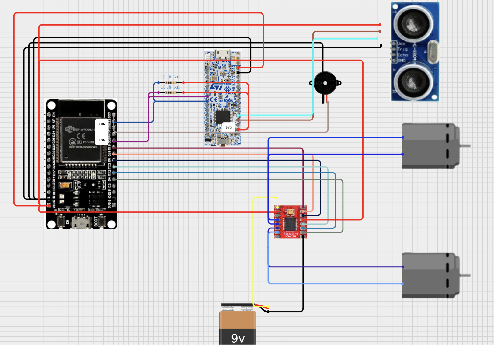

# X1 ESP32 Vehicle Firmware

PlatformIO firmware for an `ESP32 DevKit`-class board that drives a two-motor vehicle over `ESP-NOW`, receives obstacle distance data over `I2C`, and applies an emergency stop when safety mode is enabled.

### Diagram



## Overview

This firmware does four things:

1. Receives control messages over `ESP-NOW`.
2. Drives two DC motors with PWM and direction pins.
3. Accepts distance updates from another controller over `I2C` slave address `0x08`.
4. Stops the vehicle and sends feedback when an obstacle is detected within the stop threshold.

The active PlatformIO environment is `esp32dev` using the Arduino framework.

## Features

- `ESP-NOW` receiver for gear, safety, drive, and buzzer commands
- Dual-motor differential steering
- Smoothed acceleration and braking in drive mode
- Immediate response mode in sport gear (`S`)
- I2C slave interface for distance sensor input
- Emergency brake logic for forward-driving gears
- Feedback packet sent back to the remote controller during emergency stop

## Project Structure

- `platformio.ini` - PlatformIO environment configuration
- `src/main.cpp` - main firmware logic, wireless receive callback, motor task, I2C receive handler
- `src/config.h` - pin mapping, thresholds, PWM tuning, and remote MAC address

## Hardware Assumptions

- ESP32 development board compatible with `board = esp32dev`
- 2 DC motors with a dual H-bridge motor driver
- External controller/sensor node sending `uint32_t` distance data over I2C
- Remote ESP device sending control messages over `ESP-NOW`
- Buzzer connected to a digital output

## Pin Mapping

Defined in `src/config.h`:

| Function    | GPIO |
| ----------- | ---: |
| I2C SDA     |   21 |
| I2C SCL     |   22 |
| Motor 1 PWM |    4 |
| Motor 1 IN1 |   17 |
| Motor 1 IN2 |   16 |
| Motor 2 PWM |   19 |
| Motor 2 IN1 |    5 |
| Motor 2 IN2 |   18 |
| Buzzer      |   23 |

## Control Model

### Incoming ESP-NOW message types

The first byte of each packet is a type marker:

- `0` - gear update
- `1` - safety mode on/off
- `2` - driving command
- `3` - buzzer on/off

### Driving command payload

`DrivingData`:

```cpp
struct DrivingData {
    float angle;
    int power;
};
```

- `angle`: steering angle used to reduce left or right motor speed
- `power`: `0-100`, mapped to PWM `0-255`

### Feedback payload

When emergency braking is active, the firmware sends:

```cpp
struct FeedbackData {
    bool emergencyBrakeActive;
    float distance;
};
```

## Safety Logic

- Distance values are received over I2C and stored in `globalDistance`
- If `safety mode` is enabled and the vehicle is in gear `D` or `S`, the firmware checks obstacle distance
- If the measured distance is between `1 cm` and `STOP_DISTANCE` (`5 cm`), both motors are electrically braked and PWM output is set to zero
- While emergency braking is active, a feedback packet is transmitted to the configured remote peer

`LOG_DISTANCE` is set to `30 cm`, so obstacle distance is also printed to serial output when objects are nearby.

## Gear Behavior

- `N` - stop motors and reset smoothed power
- `D` - forward with acceleration/braking smoothing
- `S` - forward with immediate target PWM
- `R` - reverse

## Configuration

Update `src/config.h` for your hardware:

- `REMOTE_ADDR` - MAC address of the remote ESP-NOW peer
- `STOP_DISTANCE` - emergency stop threshold in cm
- `LOG_DISTANCE` - serial logging threshold in cm
- `ACCEL_STEP` and `BRAKE_STEP` - response tuning
- Motor and buzzer GPIO assignments

## Build and Upload

### Requirements

- [PlatformIO Core](https://platformio.org/install)
- ESP32 board connected over USB

### Commands

```bash
pio run
pio run -t upload
pio device monitor -b 115200
```

Or open the project in VS Code with the PlatformIO extension and use the `esp32dev` environment.

## Runtime Notes

- Serial monitor speed is `115200`
- Wi-Fi is forced into `WIFI_STA` mode for `ESP-NOW`
- The firmware sets Wi-Fi channel `1`, so the remote peer must use the same channel
- The ESP32 prints its MAC address at startup, which helps during peer pairing
- I2C is initialized as a slave with address `0x08`

## Known Limitations

- Buzzer support is only simple on/off control
- ESP-NOW packets are accepted without encryption
- The source includes a note indicating reverse behavior in safety mode may still need debugging
- No automated tests are included yet
